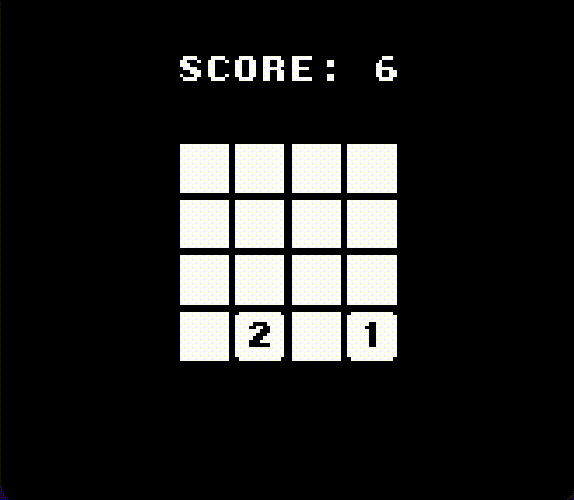

## A simple 2048 style game for Game Boy


Project to learn writing C and using [GBDK](https://gbdk.org/)

## Setup
Download or clone this repository and place it next to the gbdk folder, e.g.:
```
.
└── GB_PROJECTS/
    ├── gbdk
    └── NUMBLOCKS
```

to build, run:
```
make rom
```
